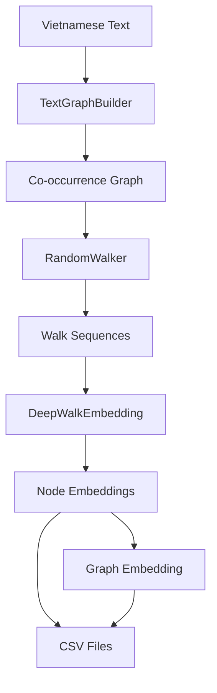

# Graph Embedding Pipeline

Pipeline hoàn chỉnh để chuyển văn bản tiếng Việt thành vector đặc trưng đồ thị.

## Tổng quan

Pipeline này kết hợp:
1. **Text Processing**: Phân tích văn bản tiếng Việt
2. **Graph Construction**: Xây dựng đồ thị đồng xuất hiện từ
3. **Random Walks**: Tạo chuỗi random walk trên đồ thị
4. **DeepWalk Embeddings**: Học biểu diễn vector cho nodes và graph

## Cài đặt

```bash
pip install networkx gensim pandas underthesea streamlit
```

## Sử dụng

### 1. Demo nhanh
```bash
python graph_embedding.py
```

### 2. Interactive mode
```bash
python graph_embedding.py --interactive
```

## Pipeline Components

### 1. TextGraphBuilder
- **Input**: Văn bản tiếng Việt
- **Process**: Token hóa → Co-occurrence matrix → NetworkX graph
- **Output**: Đồ thị có trọng số

### 2. RandomWalker  
- **Input**: NetworkX graph
- **Process**: Random walks với độ dài và số lượng định sẵn
- **Output**: Danh sách sequences

### 3. DeepWalkEmbedding
- **Input**: Random walk sequences
- **Process**: Word2Vec training (Skip-gram)
- **Output**: Node embeddings

### 4. GraphEmbeddingPipeline
- **Input**: Raw text
- **Process**: Kết hợp 3 components trên
- **Output**: Node embeddings + Graph embedding

## Output Format

### Node Embeddings: `{name}-node_embedding.csv`
```
node,0,1,2,...,63
học,0.123,-0.456,0.789,...,0.321
sinh,-0.234,0.567,-0.891,...,0.654
```

### Graph Embedding: `{name}-graph_embedding.csv`
```
0,1,2,...,63
0.123,-0.456,0.789,...,0.321
```

## Parameters

| Parameter | Default | Description |
|-----------|---------|-------------|
| `window_size` | 3 | Kích thước cửa sổ co-occurrence |
| `weight_method` | 'frequency' | Phương pháp tính trọng số |
| `walk_length` | 10 | Độ dài mỗi random walk |
| `num_walks` | 5 | Số walks per node |
| `vector_size` | 64 | Kích thước embedding vector |
| `epochs` | 20 | Số epochs training |
| `min_frequency` | 1 | Tần suất tối thiểu của từ |

## Example Usage trong Code

```python
from graph_embedding import GraphEmbeddingPipeline

# Khởi tạo pipeline
pipeline = GraphEmbeddingPipeline(
    window_size=3,
    vector_size=128,
    walk_length=15,
    num_walks=10
)

# Xử lý text
text = "Học sinh đi học tại trường đại học..."
node_embeddings, graph_embedding = pipeline.process_text_to_embeddings(text)

# Lưu kết quả
pipeline.save_embeddings("my_text")

# Xem thống kê
stats = pipeline.get_stats()
print(stats)
```

## DeepWalk Algorithm

DeepWalk sử dụng thuật toán sau:

1. **Random Walks**: Từ mỗi node, thực hiện random walks
   $$W_i = (v_{i,0}, v_{i,1}, ..., v_{i,k})$$

2. **Skip-gram Training**: Tối ưu hóa
   $$\mathcal{L} = -\log P(v_k \mid \Phi(v_j))$$

3. **Node Embeddings**: Mỗi node $v$ có vector $\Phi(v) \in \mathbb{R}^d$

4. **Graph Embedding**: Trung bình của tất cả node embeddings
   $$\Phi_{graph} = \frac{1}{|V|} \sum_{v \in V} \Phi(v)$$

## Workflow

